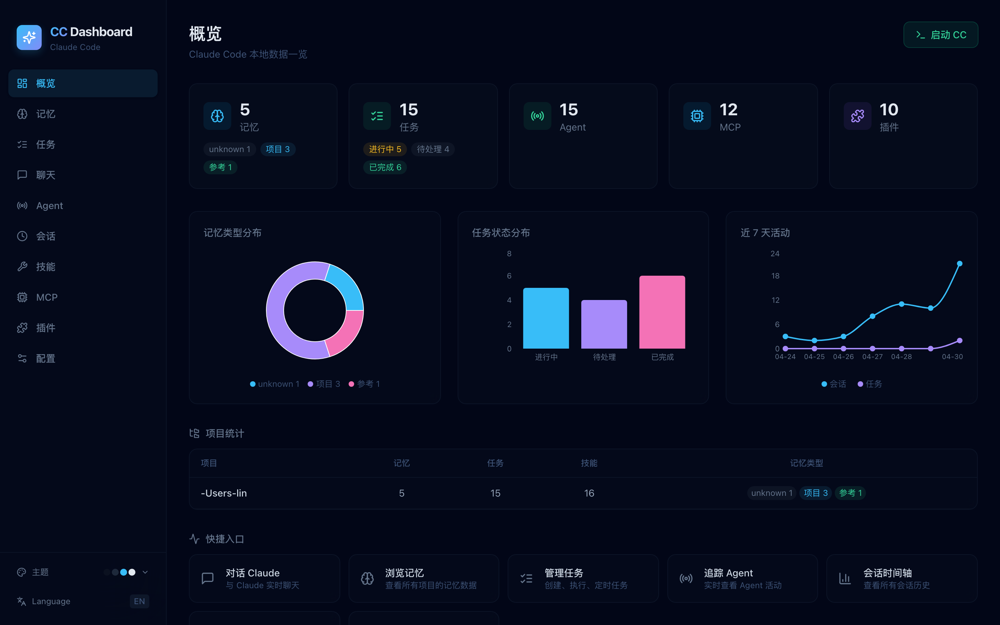
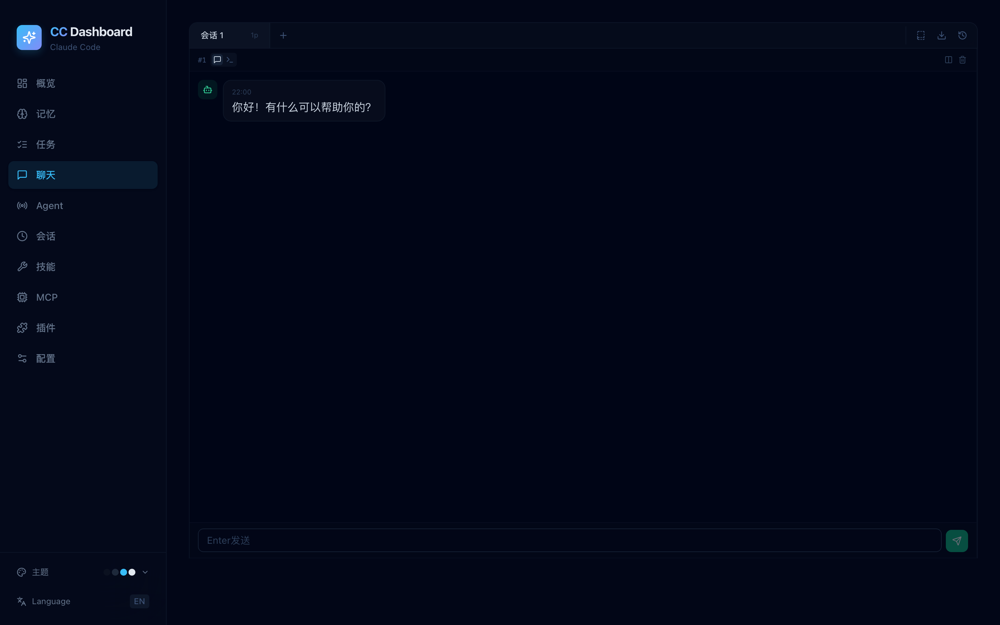
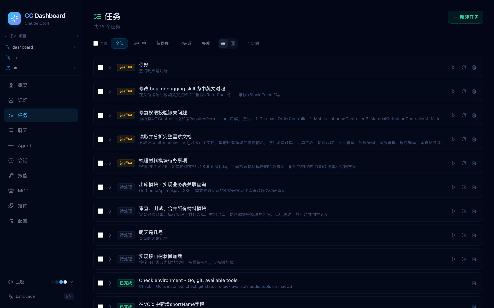
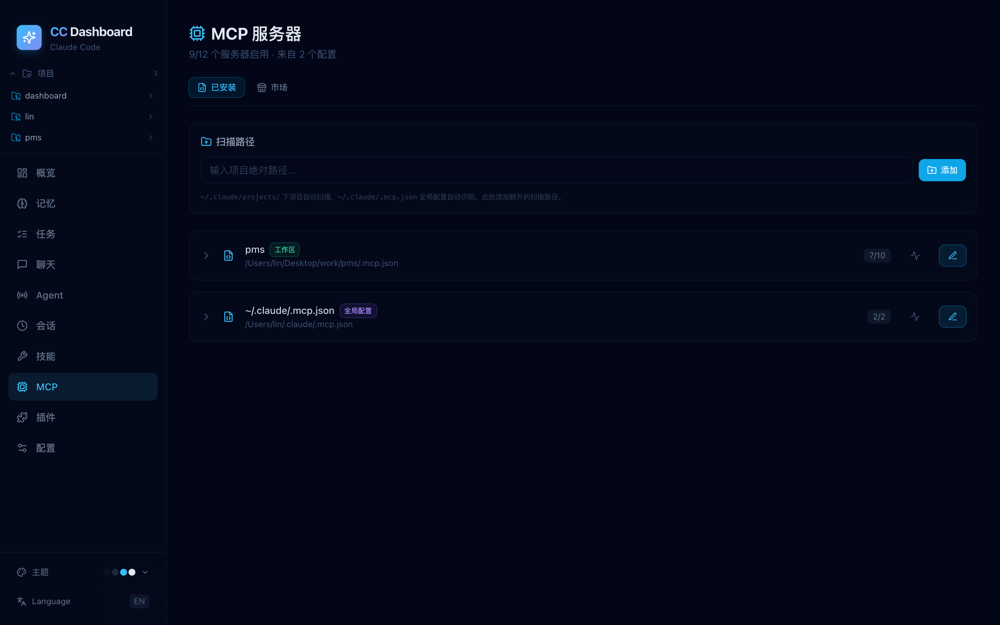
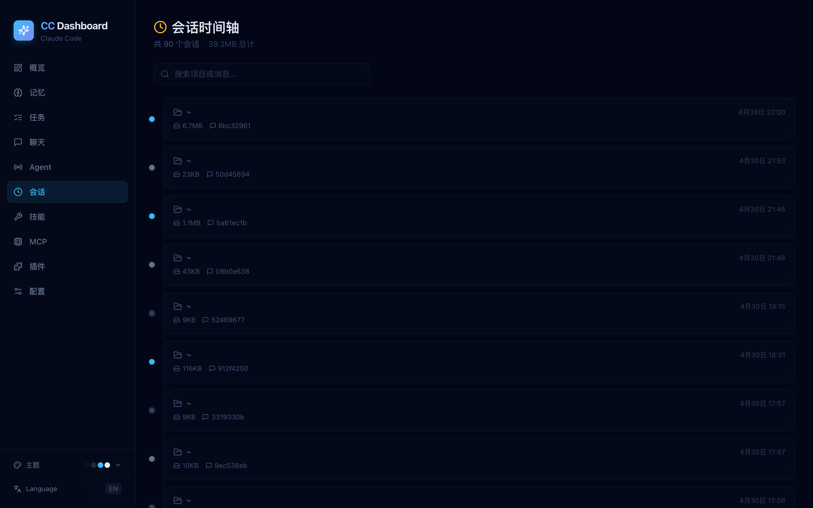
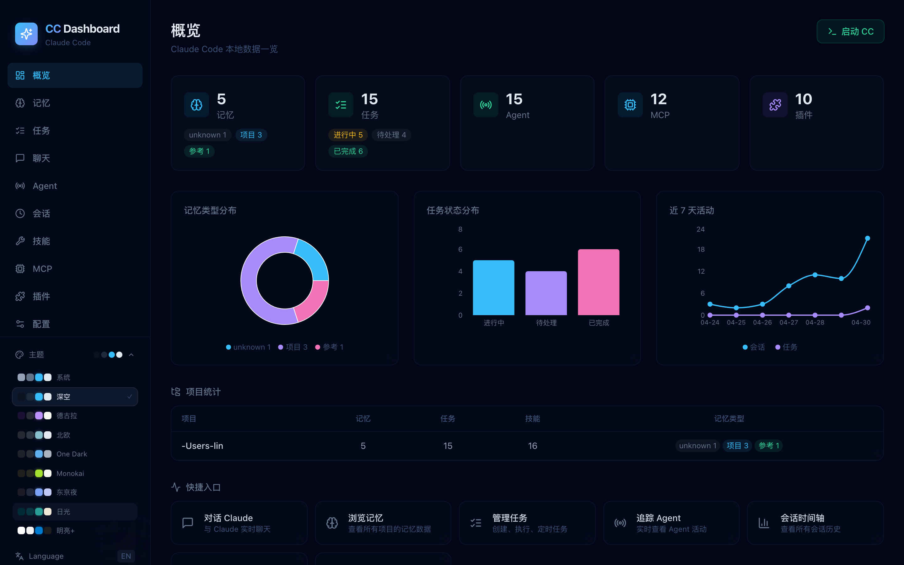

# CC Dashboard

Claude Code 的 Web 可视化面板 —— 一站式管理记忆、任务、技能、MCP、插件、聊天会话等。


---

## 功能概览

| 模块 | 说明 |
|------|------|
| **概览** | 统计面板，记忆/任务图表，7 日活动趋势，项目分布 |
| **聊天** | 流式 AI 对话，多标签页 + 分屏面板，支持编辑/复制/导出 Markdown |
| **记忆** | 浏览和编辑 Claude Code 的项目记忆文件 |
| **任务** | 看板 + 列表双视图，定时调度，批量操作，内联执行 |
| **会话** | 所有 Claude Code 会话时间轴，支持搜索、收藏、标签 |
| **技能** | 浏览 Markdown 技能文件，支持编辑/预览，区分全局和项目来源 |
| **MCP** | 管理 MCP 服务器配置，健康检查，**市场搜索与一键安装** |
| **插件** | 已安装插件管理，**NPM 市场搜索与一键安装** |
| **Agent** | Agent 追踪，树形/拓扑图双视图 |
| **配置** | 编辑 settings.json / settings.local.json |
| **搜索** | Ctrl+K 全局搜索记忆、任务、技能 |
| **命令** | Ctrl+P 命令面板快速导航 |

## 界面预览

| 概览 | 聊天 |
|------|------|
|  |  |

| 任务看板 | MCP 管理 |
|----------|----------|
|  |  |

| 会话时间轴 | 主题切换 |
|------------|----------|
|  |  |

## 特性

- 多套 IDEA 风格主题（深空、德古拉、北欧、One Dark、Monokai、东京夜、日光、明亮）
- 中英文双语界面
- 提示词模板库，一键填充
- 对话导出为 Markdown 文件
- 会话收藏与标签管理
- MCP / 插件市场直接搜索安装，无需手动配置

## 快速开始

```bash
# 克隆并安装
git clone https://github.com/YOUR_USER/cc-dashboard.git
cd cc-dashboard
npm install

# 启动开发服务器 → http://localhost:5173
npm run dev
```

> **前置条件：** Node.js 18+，已安装 [Claude Code](https://claude.ai/code)（`~/.claude/` 目录存在）。

## 原理

面板直接读取本地 `~/.claude/` 目录，**不会**修改 Claude Code 内部文件（MCP 配置和插件安装等显式操作除外）。

```
~/.claude/
├── projects/    → 记忆、.mcp.json、会话 JSONL
├── tasks/       → 任务定义
├── skills/      → 自定义技能
├── plugins/     → 已安装插件 + 市场
├── chats/       → 保存的聊天会话
├── settings.json
└── .mcp.json    → 全局 MCP 配置
```

后端 API 嵌入为 [Vite 中间件](vite.config.ts)，无需单独启动服务器。

## MCP 市场

1. 进入 **MCP** → **市场** 标签
2. 搜索关键词（如 "filesystem"、"git"、"database"）
3. 点击 **安装**，可选自定义服务器名称
4. 自动写入 `.mcp.json`，重启 Claude Code 生效

## 插件市场

1. 进入 **插件** → **市场** 标签
2. 搜索关键词
3. 点击 **安装**，自动 npm install 到 `~/.claude/plugins/`

## 环境变量

| 变量 | 用途 |
|------|------|
| `CC_MCP_PATHS` | 额外的项目路径，用于扫描 `.mcp.json`（冒号分隔） |

## 生产构建

```bash
npm run build
npm run preview   # 预览构建产物 → http://localhost:4173
```

## 技术栈

- **React 19** + TypeScript
- **Vite 6** + Tailwind CSS 4
- **Recharts** — 图表
- **Lucide React** — 图标
- **React Router 7** — 路由
- **React Markdown** + remark-gfm — Markdown 渲染

## 协议

MIT
